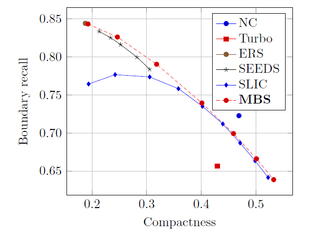

# MBS

Minimum Barrier Superpixel Segmentation

A concise superpixel algorithm based on minimum barrier distance transform (MBS).

MBS can achieve higher boundary recall compared with SLIC, and about 15% faster than it.

